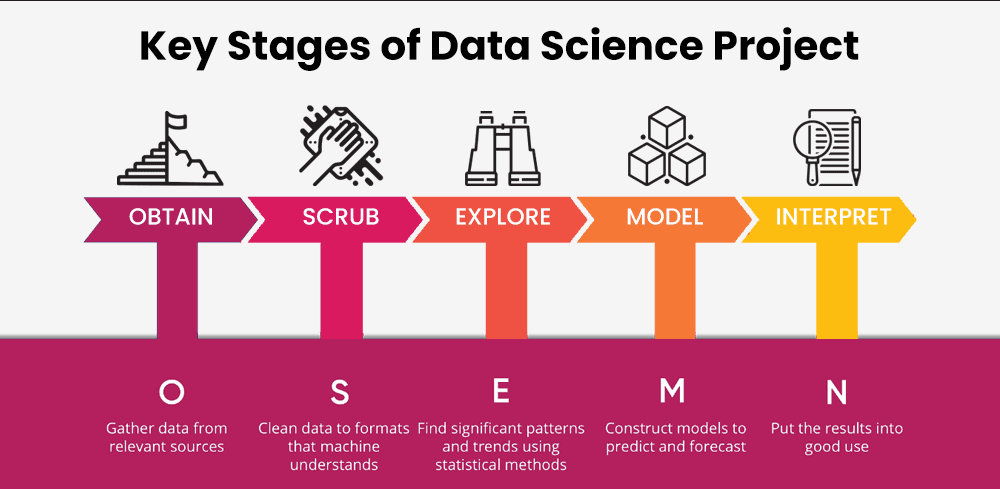
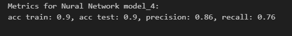
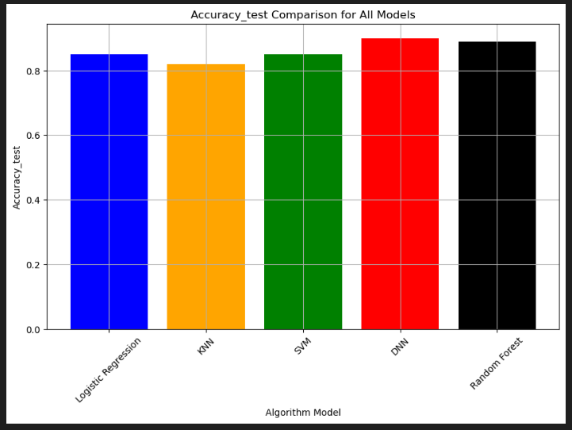
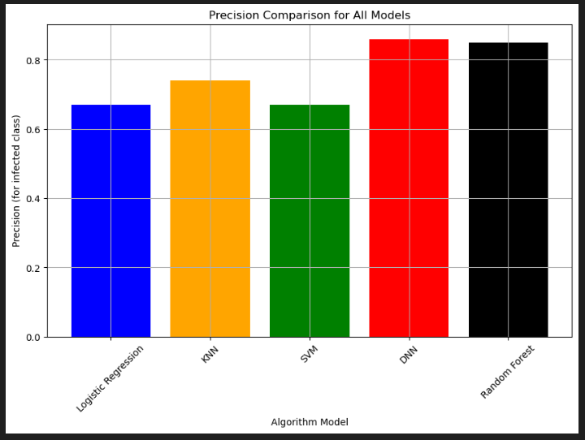
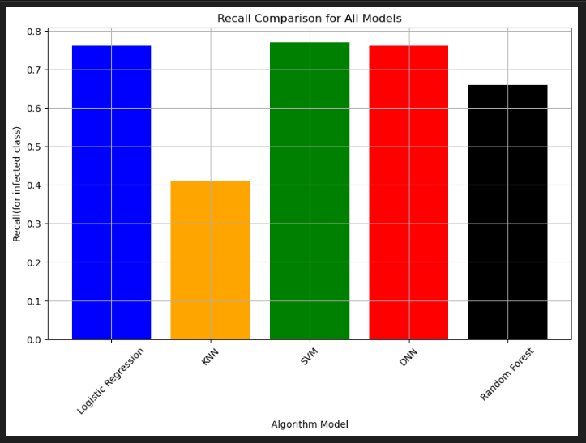

# Predicting AIDS Progression with Data Insights

## Background
HIV/AIDS remains a significant global health challenge, and early detection of progression from HIV to AIDS is crucial for effective treatment and management.
This project will provide valuable insights to healthcare practitioners and policymakers, helping them implement effective strategies to reduce the number of people contracting AIDS.

## Overview of the Analysis

The purpose of this analysis is to create a binary classification model using different machine learning techniques to predict if an individual with HIV symptoms will be infected to AIDs after receiving particular treatment after 20 days. The models utilises a dataset of 2139 individuals with HIV symptoms that have received different types of treatment over 20 days, after this period of time their cd4 cells were measured to check the improvement with symptoms and determining if they are infected to AIDS virus or not. 

## ETL
In this project we have saved our dataset in the PostgreSQL database before consuming the data. AIDs.sql is the SQL code for creating the table, Data_cleaning.ipynb is where we did the transform stage (data cleaning). These are the steps in our ETL pipeline:

* Extract data as a CSV file from Kaggle 
* Clean data with Pandas and export as CSV file
* Design an ERD and table schema for the database
* Create and populate PostgreSQL database table in PgAdmin
* Connect to PostgrSQL database with SQLAlchemy and query the data
* Load data into a Pandas DataFrame to utilise our different algorithms

## Data Preprocessing

Our dataset includes "treatment", "ZDV_only_treatment","off_treatment","hemophilia", "homosexual_activity", "drugs", "race",\
"gender", "karnofsky_score","therapy_prior","ZDV_last_30days","ART_history","ART_history_stratified", "symptom". The detailed information about each feature and also a comprehensive report of the project is provided in the Project4_Predicting_AIDS_Pprogression_Report.pdf file.
 . Data exploration and data visualisation can be find in the Data_explore_and_vis.ipynb.
 A Tableau dashboard is created to provide an insight to variables affecting AIDS infection rate. It can be find on Tableau Public https://public.tableau.com/shared/BJN54DFNP?:display_count=n&:origin=viz_share_link

  The preprocessing steps include:

* Identifying and handling null values
* Identifying important variables for model training
* Identifying categorical and numerical values
* Scaling numerical values

## Machine Learning Models
Implement multiple machine learning algorithms, including Neural Networks, Random Forest, SVM, KNN and, Logistic Regression models.  
Train and validate each model using appropriate evaluation metrics, such as accuracy, precision, recall, and F1-score.  
Compare the performance of each model based on evaluation metrics to determine the most effective approach. 
All the implemented ML models can be find in the AIDS_prediction_Final.ipynb file.

According to the concept of our medical dataset and the importance of predicting individuals infected with AIDS in order to getting timely treatment, accuracy and recall for the infected class(class 1)  are considered as the most important metrics for choosing the best model in this project. So Neural Network is the best model with an accuracy of % 90 and a recall of %76.

Following bar charts are for comparing the performances for all the five models in this project:

Presentation's link (Googlslides' link): https://docs.google.com/presentation/d/1D3vEEJBtSdzjs0V-5wAVASOkNl1E6pXCJOlBWUzTwlU/edit#slide=id.g4dfce81f19_0_45

## Data source
Data source: https://www.kaggle.com/datasets/aadarshvelu/aids-virus-infection-prediction/data

## License
This project is licensed under the MIT License. 
